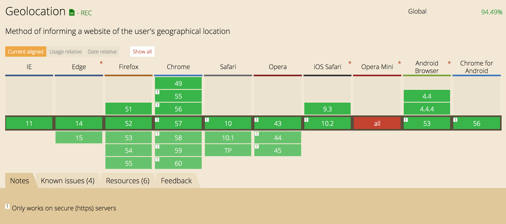
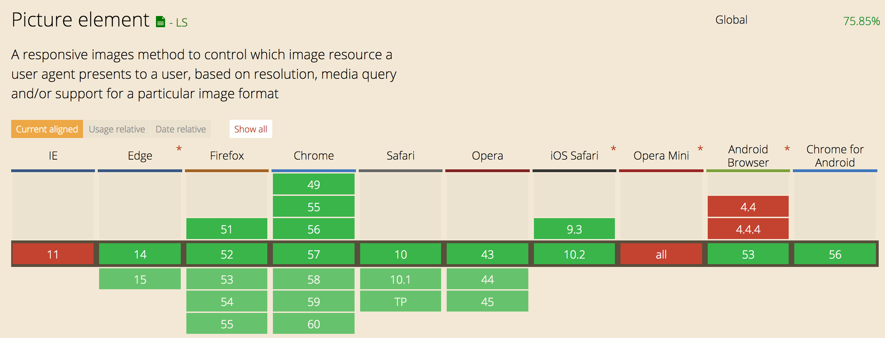
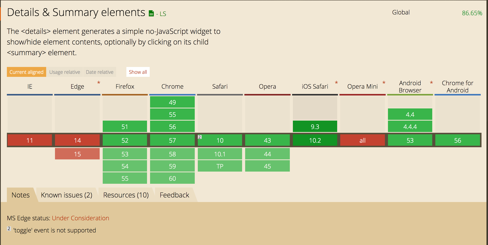
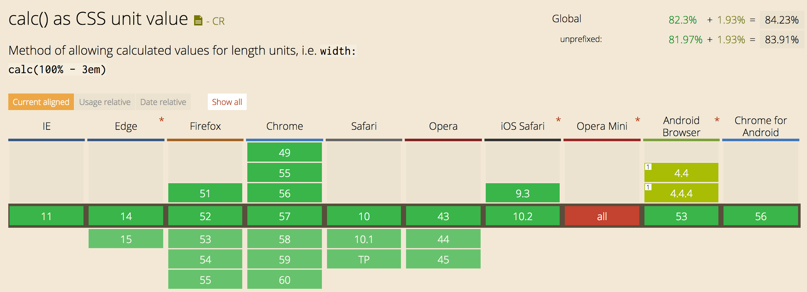

# Feature 1 - Geolocation [JS]



Geolocation is not yet supported by all browsers, I've build a really simple example of a fallback that can be used to prevent problems if someones browser doesn't support the feature.

1. There is a check if the Geolocation feature is available.
2. If the feature is available, the location will be printed on the page (longitude and latitude).
3. If the feature is not available, a form will show where the user can enter its own location.

Using this fallback, the user can fill in it's location. If the geolocation functionality does work, its easier for the user. But if the functionality doesn't work, we can ask the user where he is.

http://diveintohtml5.info/detect.html#geolocation

# Feature 2 - ?? [JS]

# Feature 3 - Picture Element [HTML]



The picture element is a new HTML element for showing pictures. The element makes makes images responsive (serve a quality based on screen width) without using CSS. Though, not all browsers support the feature yet.

- If the picture tag is supported: One of the 3 pictures with in the ```<source>``` elements will show. Based on the screen-size you'll get a specified picture in a high, medium or low resolution.
- If the picture tag is not supported, the `````` element will be shown, the ```<source>``` elements will be ignored.

# Feature 4 - Details and Summary element [HTML]



The details and summary element isn't supported by all the browsers yet. The element makes it possible to make an expandable detail section with a title and a description in it. The block is supposed to be working without JavaScript. Since not all browsers support the tag yet, I've made a fallback to make sure it works everywhere.

```
<script>
  if (!('open' in document.createElement('details'))) {
    document.getElementById('fallback').classList.remove('hidden');
  }
</script>
```

The script above checks if the details element is supported by checking if it is possible to create one. If that is not possible, I've build another detail section using ```div``` elements. If the user clicks on the header, the summary will open. I've made this possible by using the css ```:target``` selector. So there is no JS needed.

http://html5doctor.com/the-details-and-summary-elements/

# Feature 5 - Calc() [CSS]



The CSS calc() can help you to make a calculation. The functionality isn't supported in all browsers though. There is a simple solution to tackle this problem. I've used the CSS you see here:

```  h1 {
    color: white;
    margin: 12.5%;
    margin: calc(25% - 5.5em);
  }
```

If the browser doesn't support calc(), it will fallback on the width you see declared above the ```margin: calc(..);```

# Feature 6 - ?? [CSS]
