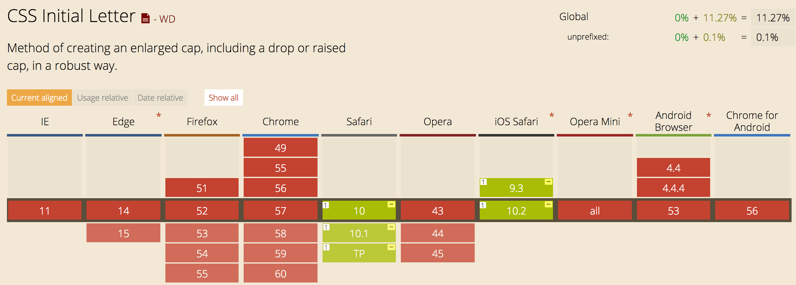

# Feature 1 - Geolocation [JS]


Geolocation is not yet supported by all browsers, I've build a really simple example of a fallback that can be used to prevent problems if someones browser doesn't support the feature.

1. There is a check if the Geolocation feature is available.
2. If the feature is available, the location will be printed on the page (longitude and latitude).
3. If the feature is not available, a form will show where the user can enter its own location.

Using this fallback, the user can fill in it's location. If the geolocation functionality does work, its easier for the user. But if the functionality doesn't work, we can ask the user where he is.

- [Code](https://github.com/camille500/browser-technologies/blob/master/Week2/feature1.html)
- [Live Version](http://camille-sebastien.com/bt/feature1.html)

http://diveintohtml5.info/detect.html#geolocation

# Feature 2 - Google Maps [JS]

I've used the Google Maps API to show users a specified location on the map. The API needs JavaScript to work, so I came up with a fallback that makes it possible to show the location, even without JavaScript.

- The user with JavaScript gets to see an interactive map from the Google Maps API
- Users without JavaScript get to see a picture with the location, so even without JS they know where to go.

- [Code](https://github.com/camille500/browser-technologies/blob/master/Week2/feature2.html)
- [Live Version](http://camille-sebastien.com/bt/feature2.html)

# Feature 3 - Picture Element [HTML]


The picture element is a new HTML element for showing pictures. The element makes makes images responsive (serve a quality based on screen width) without using CSS. Though, not all browsers support the feature yet.

- If the picture tag is supported: One of the 3 pictures with in the ```<source>``` elements will show. Based on the screen-size you'll get a specified picture in a high, medium or low resolution.
- If the picture tag is not supported, the `````` element will be shown, the ```<source>``` elements will be ignored.

- [Code](https://github.com/camille500/browser-technologies/blob/master/Week2/feature3.html)
- [Live Version](http://camille-sebastien.com/bt/feature3.html)

# Feature 4 - Details and Summary element [HTML]


The details and summary element isn't supported by all the browsers yet. The element makes it possible to make an expandable detail section with a title and a description in it. The block is supposed to be working without JavaScript. Since not all browsers support the tag yet, I've made a fallback to make sure it works everywhere.

```
<script>
  if (!('open' in document.createElement('details'))) {
    document.getElementById('fallback').classList.remove('hidden');
  }
</script>
```

The script above checks if the details element is supported by checking if it is possible to create one. If that is not possible, I've build another detail section using ```div``` elements. If the user clicks on the header, the summary will open. I've made this possible by using the css ```:target``` selector. So there is no JS needed.

- [Code](https://github.com/camille500/browser-technologies/blob/master/Week2/feature4.html)
- [Live Version](http://camille-sebastien.com/bt/feature4.html)

http://html5doctor.com/the-details-and-summary-elements/

# Feature 5 - Calc() [CSS]


The CSS calc() can help you to make a calculation. The functionality isn't supported in all browsers though. There is a simple solution to tackle this problem. I've used the CSS you see here:

```  h1 {
    color: white;
    margin: 12.5%;
    margin: calc(25% - 5.5em);
  }
```

If the browser doesn't support calc(), it will fallback on the width you see declared above the ```margin: calc(..);```

- [Code](https://github.com/camille500/browser-technologies/blob/master/Week2/feature5.html)
- [Live Version](http://camille-sebastien.com/bt/feature5.html)

# Feature 6 - Initial Letter [CSS]



The Initial Letter in CSS is supported by 11.27% of all the browsers. Actually only the browsers from safari support this new CSS method. The method creates an enlarged cap letter, that you can use using the first-letter selector on, for example an article. Because the method is really cool, i've used it for this demo.

- Users with a safari (web)browser will get to see an enlarged cap that is nicely positioned inside the text.
- Users without safari will get to see first letter a bit differently. I've styled the first letter before using the initial-letter method. So if that method won't work, the style you see down here will be applied.

```.first-letter {
  color: rgb(193, 90, 52);
  font-size: 2em;
  padding-right: .2em;
}
```

- [Code](https://github.com/camille500/browser-technologies/blob/master/Week2/feature6.html)
- [Live Version](http://camille-sebastien.com/bt/feature6.html)

***TIP:*** Also check this example in Safari

https://css-tricks.com/almanac/properties/i/initial-letter/
