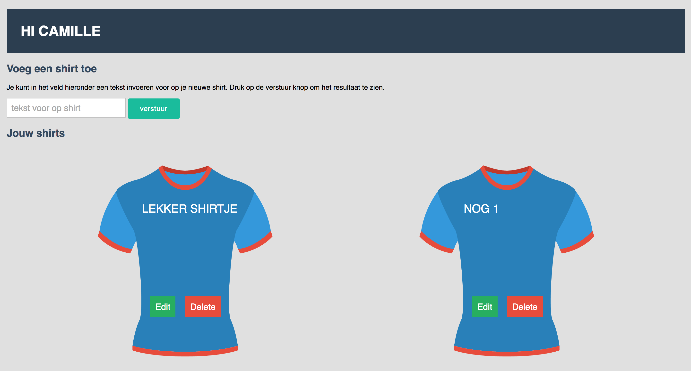
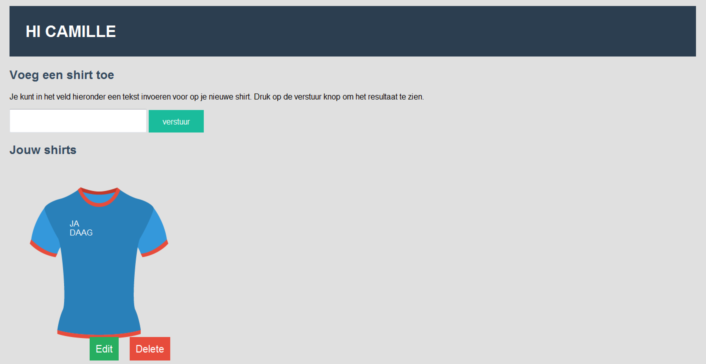
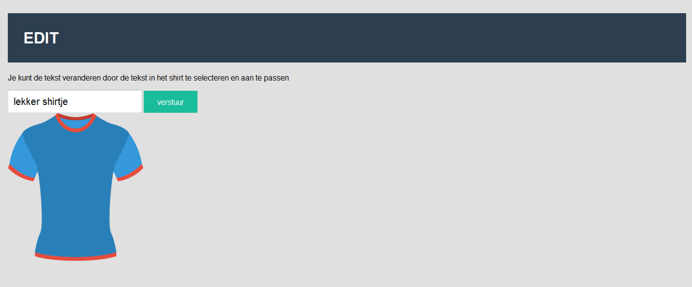
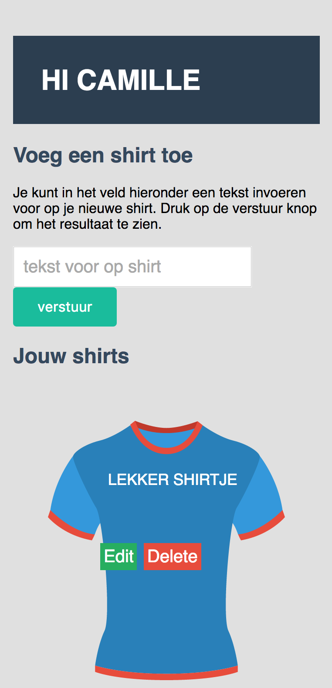
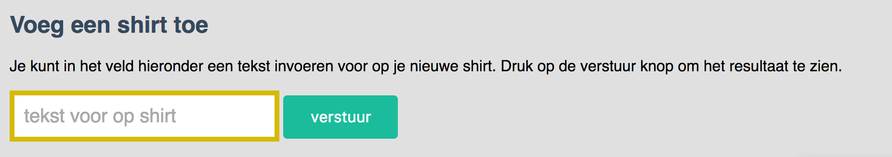
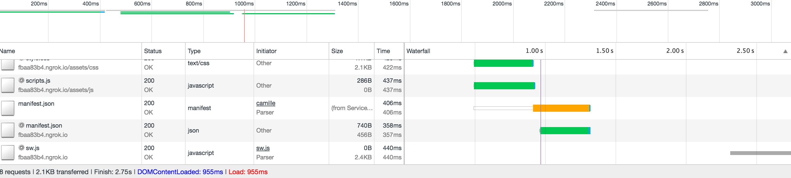

# Browser technologies - week 3

This is the documentation for the t-shirt web application I've build for the Browser Technologies course during the minor Web Development on the HvA.

## Live version

- https://bt-new.herokuapp.com/ 

## Installation

Please follow these steps to install the application

1. Clone the repository ```$ git clone https://github.com/camille500/browser-technologies.git```
2. Navigate to the folder ```$ cd your_directory/Week3```
3. Install all dependencies with ```npm install```
4. Start the application with ```npm start```
5. To get the application online, use ```npm run online```

After following these steps, the application is online!

## The user story

As user I want to create shirts with a custom text. If I'm not at home, I still want to be able to show the shirts I've created to my friends. At home I use an old computer with IE8, and I always disable JavaScript. When traveling I want to view or edit the shirts on my phone, but due to slow internet, I disabled images too. The application has to work in all of these situations, and even offline.

## What I've build

I've build an progressive web application that works without JavaScript, disabled images and even offline if the page is cached. These are the steps i've taken:

- Build an server-side application, so that JavaScript is not required for the user.
- The application works back to IE8 due to some fallbacks I've written.
- The application works without images (except older IE versions who don't support SVG) because I've used inline SVG's.
- The application can be used offline if the pages are cached. To cache the pages, i've used a serviceWorker. It's not possible to create or edit shirts while offline.
- I'm using server-side local storage to save the users data. The shirts can be viewed from any device or computer and it even works if local storage is disabled or if the user is in incognito mode.

## Features

- Create a shirt with custom text and save it.
- Access your shirt collection from anywhere, even without internet if cached.
- Edit or delete your creations.
- Add the application to your home screen.

## Browser testing

I've tested the application in multiple browsers. It was my goal to make an app that works up to IE8. These are some screenshots from the tests:

### Google Chrome


### IE8



Not all styling is perfect yet in the IE tests, but thats something I still want to work on. All functionality works perfectly though.

### Mobile


Also on mobile there are still some styling improvements to do, but all functionality works fine.
I've tested the app on different devices in the Device lab: Apple Ipod, Apple Ipad, Google Nexus and Nokia Windows Phone.

## Not supported Features

- ***Flexbox:*** I've build a inline-block fallback for older browsers.
- ***localStorage:*** I've made the app working on the server, so there is no need for local storage.
- ***SVG:*** Not supported in older browsers, PNG fallback if so.

## Mouse and trackpad

The whole is accessible by tabbing trough the inputs and urls. There is a nice focus state so you can see where you at. See the screenshot below.



## Broadband

I've tested the website with a 3G Regular connection. The website still loads fast, also because it was cached by a service worker.


