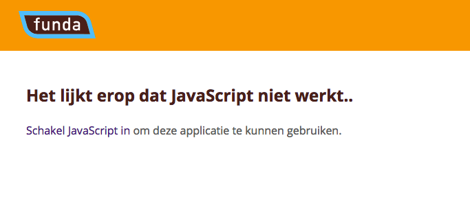
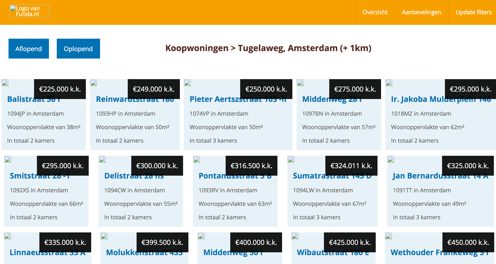
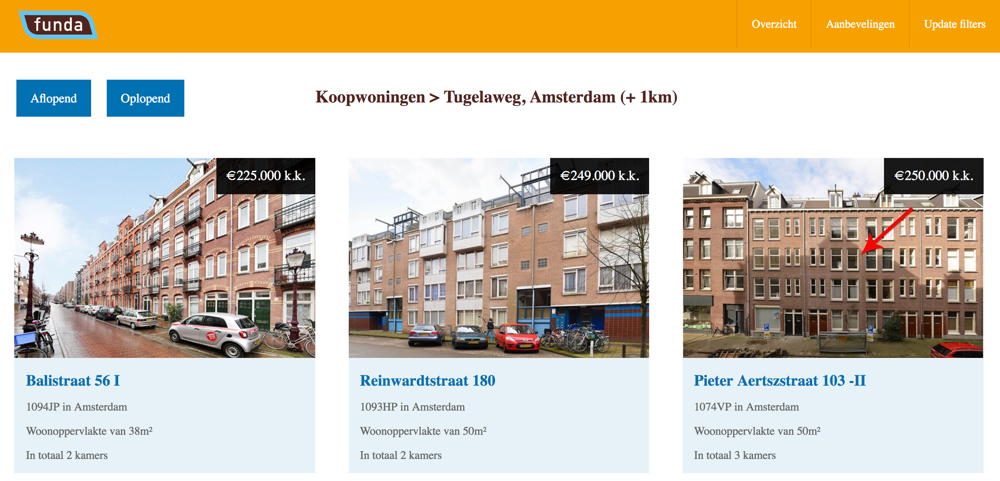
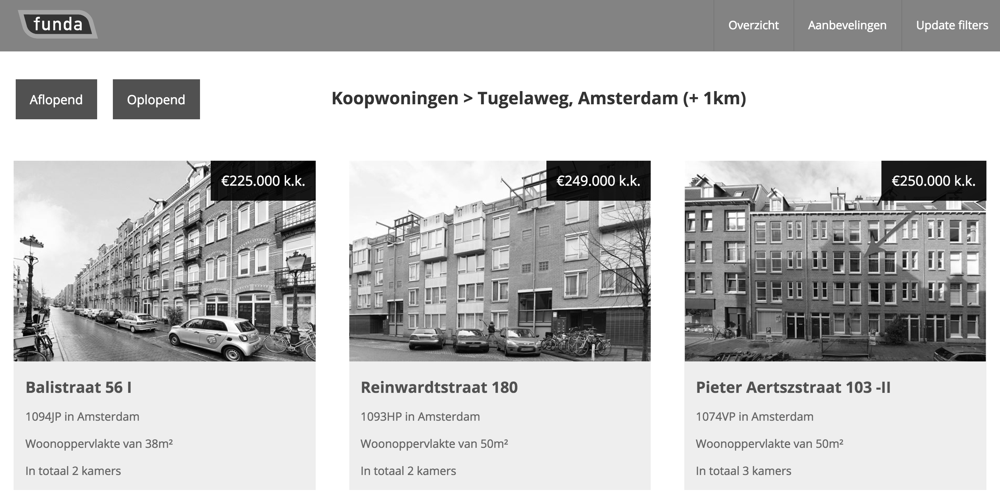
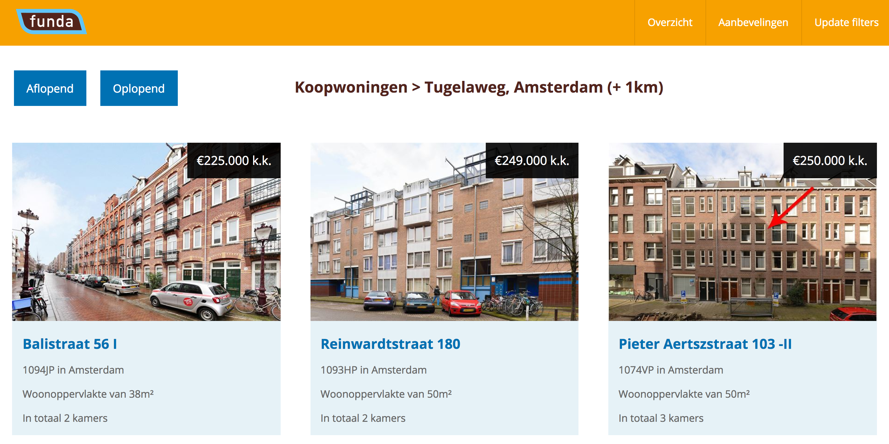
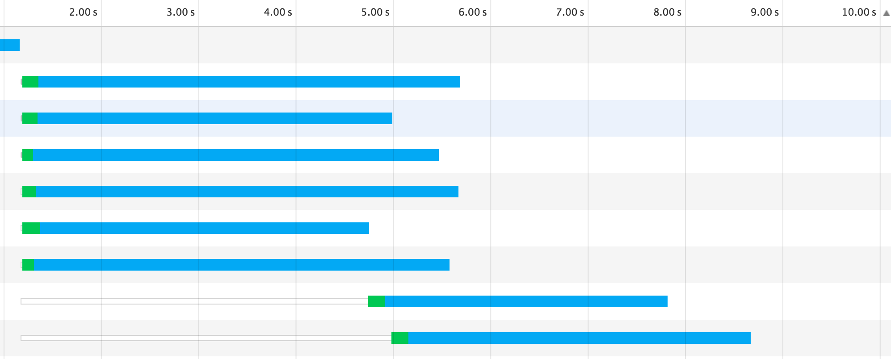
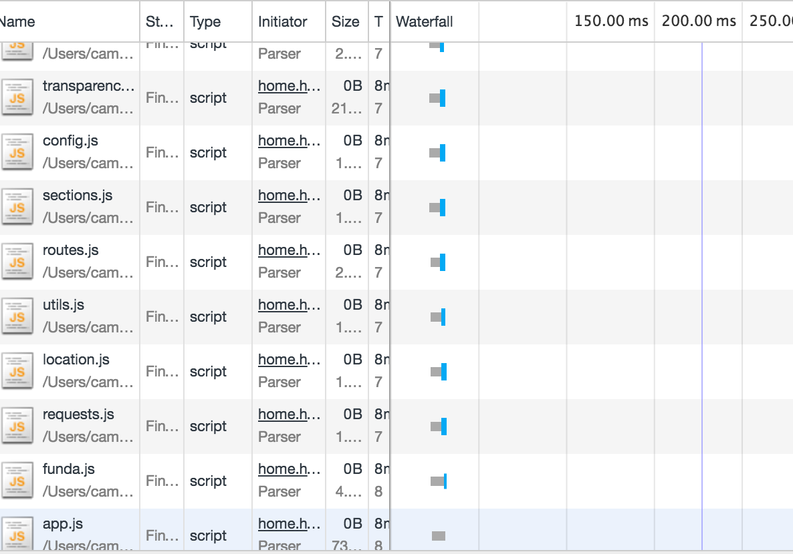
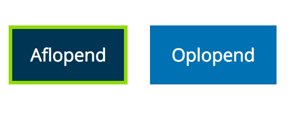
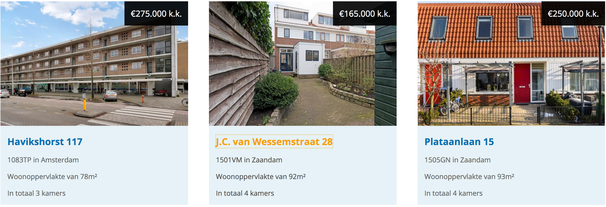

# Progressive enhancement on Funda Application

I've done a progressive enhancement audit on the Funda Application I've build in the last project. This are the results

## Table of contents
- [Javascript](#javascript)
- [Images](#images)
- [Fonts](#fonts)
- [Colors](#colors)
- [Cookies](#cookies)
- [LocalStorage](#Localstorage)
- [Broadband](#broadband)
- [Trackpad/Mouse](#no-mouse)

### The app without JavaScript

The application gets all its data from an API by a XMLHttpRequest. Also most of the routing goes via JavaScript. Before disabeling JavaScript I didn't expect the application to work. I've build a fallback for that allready. In the image below you see the message that the user sees when JS is disabled.

##### More solutions

- All the menu functionality can be done via the CSS :target selector.
- JavaScript should be used as an extra functionality, but in this case that is allmost impossible because the API is the main functionality of the application

### The app without images

After searching, the user gets a list of possible matches. Each item has a photo and a short description. If you disable images, the layout breaks as seen in the image below.

The biggest problem is that the image holder has no fixed width and height. The whole is now not so clear to read anymore. Also the logo seems not to be working

##### To Do

- Add a inline SVG logo so that if images are disabled, the logo is still shown.
- Add fixed width and height to the image holders.
- Styling the image holder using the Alt attribute

### The app without used fonts

As you can see in the example above, the application still works fine without the 'Open Sans' font I'm using. The only problem is that I have no sans-serif fallback. The total style of the application doesn't look to good because of that. The app uses no icon fonts, so thats not a problem.

##### To Do

- Add a sans-serif fallback instead of the standard fallback.

### Colors
Since I'm colorblind myself, its easy to say if the application works out for me. The colors are very clear and different from each other. I've also tested the website in black and white, the example is here below.

As you can see, there is a good contrast between the colors. That makes it possible to view the application in black and white. So even for the hardcore colorblind people, the app is accessible.

### Cookies turned off
I dont use cookies, so it wasn't a problem when turned of

### Localstorage
The application uses Localstorage to store its data. I've build in a fallback in case the Localstorage doesn't work. In that case the application does a new API call for every search query. There is one problem though, the filters wont work because they depend on data from Localstorage.

##### To Do
- Make sure sorting still works without Localstorage, by storing it in the cache.

### Broadband
I've tested the application in 2 different connections.
The first one was a regular 2G connection of 300ms / second.

The second one was a regular 3G connection of 100ms / second.

The images are not loading that fast. Thats because the images sizes are really big. A solution would be to use smaller images from the Funda API. Also the JavaScript is seperated over different modules, that are all loaded into the app. The app has to do a lot of requests. It's better to concat, minify and uglify it to one file. That can be done using Gulp

##### To Do

- Use Gulp to concat, minify and uglify the fonts
- Use a fontfaceobserver to make sure there is no FOIT.
- Use smaller images from the Funda API.

### Navigation without mouse

I've added focus states to all links and input elements in the application, so its easy to TAB trough the website. There are some small improvements, but not to much.

##### To Do

- Some small visual improvements

## Tools I've used

- The Chrome devtools
- [Web Developer plugin for Chrome](https://chrome.google.com/webstore/detail/web-developer/bfbameneiokkgbdmiekhjnmfkcnldhhm)
